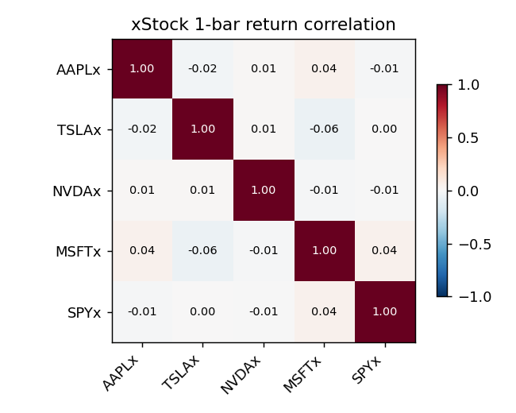

# xStocks pre-trade analysis (5m)

> **Caveat.** xStocks trade 24/7 on Bybit; the underlying US equities trade 09:30-16:00 ET. This backtest uses the underlying as a price proxy and **understates** off-hours risk and NAV-premium/discount churn. The `ema_breakout` strategy in particular overstates edge because real overnight gaps on the token are partially priced in.

- Data sources: AAPLx=synthetic, TSLAx=synthetic, NVDAx=synthetic, MSFTx=synthetic, SPYx=synthetic

## Per-symbol snapshot

| symbol   |   price | daily_change_pct   | realised_vol_ann   | atr_pct   |   rsi_14 | vwap_dist_pct   |   vol_z_30 | mom_20   | ema_trend   | regime   | recommended_strategy   |
|:---------|--------:|:-------------------|:-------------------|:----------|---------:|:----------------|-----------:|:---------|:------------|:---------|:-----------------------|
| AAPLx    | 232.897 | +3.11%             | 30.0%              | +0.39%    |    41.66 | +0.62%          |       1.58 | -0.21%   | up          | range    | vwap_pullback          |
| TSLAx    | 344.909 | +3.37%             | 56.0%              | +0.59%    |    58.78 | +1.44%          |       0.15 | +0.90%   | up          | range    | vwap_pullback          |
| NVDAx    | 131.664 | +1.85%             | 52.1%              | +0.60%    |    54.63 | +1.02%          |       0.31 | +0.56%   | up          | trend    | vwap_pullback          |
| MSFTx    | 371.989 | -0.95%             | 27.3%              | +0.34%    |    41.7  | -0.70%          |      -0.15 | -0.83%   | down        | range    | rsi_mean_reversion     |
| SPYx     | 528.174 | -0.11%             | 17.4%              | +0.22%    |    53.91 | -0.05%          |       0.16 | +0.31%   | range       | range    | rsi_mean_reversion     |

## Ranked sub-tables (top 5)

**Highest realised vol**

| symbol   |   price |   realised_vol_ann |
|:---------|--------:|-------------------:|
| TSLAx    | 344.909 |             0.5603 |
| NVDAx    | 131.664 |             0.5211 |
| AAPLx    | 232.897 |             0.3003 |
| MSFTx    | 371.989 |             0.273  |
| SPYx     | 528.174 |             0.1739 |

**Strongest 20-bar momentum**

| symbol   |   price |   mom_20 |
|:---------|--------:|---------:|
| TSLAx    | 344.909 |  0.00903 |
| NVDAx    | 131.664 |  0.00555 |
| SPYx     | 528.174 |  0.00309 |
| AAPLx    | 232.897 | -0.0021  |
| MSFTx    | 371.989 | -0.00833 |

**Largest VWAP distance (|abs|)**

| symbol   |   price |   vwap_dist_pct |
|:---------|--------:|----------------:|
| TSLAx    | 344.909 |         0.01445 |
| NVDAx    | 131.664 |         0.01021 |
| MSFTx    | 371.989 |        -0.00703 |
| AAPLx    | 232.897 |         0.00621 |
| SPYx     | 528.174 |        -0.00046 |

**Most stretched RSI (|rsi - 50|)**

| symbol   |   price |   rsi_14 |
|:---------|--------:|---------:|
| TSLAx    | 344.909 |    58.78 |
| AAPLx    | 232.897 |    41.66 |
| MSFTx    | 371.989 |    41.7  |
| NVDAx    | 131.664 |    54.63 |
| SPYx     | 528.174 |    53.91 |

## Correlation matrix

|       |   AAPLx |   TSLAx |   NVDAx |   MSFTx |   SPYx |
|:------|--------:|--------:|--------:|--------:|-------:|
| AAPLx |   1     |  -0.024 |   0.015 |   0.042 | -0.008 |
| TSLAx |  -0.024 |   1     |   0.012 |  -0.059 |  0.003 |
| NVDAx |   0.015 |   0.012 |   1     |  -0.011 | -0.007 |
| MSFTx |   0.042 |  -0.059 |  -0.011 |   1     |  0.044 |
| SPYx  |  -0.008 |   0.003 |  -0.007 |   0.044 |  1     |

## Strategy recommendations

- **rsi_mean_reversion**: MSFTx, SPYx
- **vwap_pullback**: AAPLx, TSLAx, NVDAx
