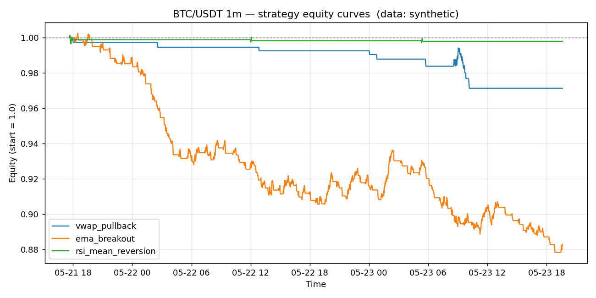

# BTC/USDT 1m backtest report

- Data source: **synthetic**
- Bars analysed: **3000**

## Headline metrics

| name               |   bars |   trades | win_rate   | avg_win_pct   | avg_loss_pct   |   profit_factor | expectancy_pct   | total_return_pct   | max_drawdown_pct   |   sharpe |   avg_bars_held |
|:-------------------|-------:|---------:|:-----------|:--------------|:---------------|----------------:|:-----------------|:-------------------|:-------------------|---------:|----------------:|
| vwap_pullback      |   3000 |       10 | 0.00%      | 0.000%        | -0.292%        |            0    | -0.292%          | -2.88%             | -2.88%             |   -33.63 |             8.2 |
| ema_breakout       |   3000 |       88 | 23.86%     | 0.536%        | -0.354%        |            0.47 | -0.142%          | -11.73%            | -12.39%            |   -37.67 |            16   |
| rsi_mean_reversion |   3000 |        3 | 0.00%      | 0.000%        | -0.071%        |            0    | -0.071%          | -0.21%             | -0.47%             |    -5.11 |             9.3 |

## vwap_pullback

- Trades: **10**  |  Win rate: **0.00%**  |  Profit factor: **0.00**  |  Max DD: **-2.88%**
- Total return: **-2.88%**  |  Expectancy/trade: **-0.292%**  |  Sharpe (annualised): **-33.63**

## ema_breakout

- Trades: **88**  |  Win rate: **23.86%**  |  Profit factor: **0.47**  |  Max DD: **-12.39%**
- Total return: **-11.73%**  |  Expectancy/trade: **-0.142%**  |  Sharpe (annualised): **-37.67**

## rsi_mean_reversion

- Trades: **3**  |  Win rate: **0.00%**  |  Profit factor: **0.00**  |  Max DD: **-0.47%**
- Total return: **-0.21%**  |  Expectancy/trade: **-0.071%**  |  Sharpe (annualised): **-5.11**
