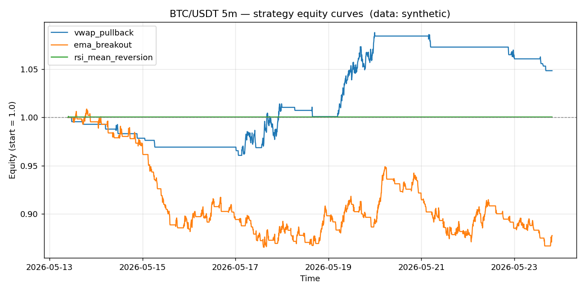

# BTC/USDT 5m backtest report

- Data source: **synthetic**
- Bars analysed: **3000**

## Headline metrics

| name               |   bars |   trades | win_rate   | avg_win_pct   | avg_loss_pct   |   profit_factor | expectancy_pct   | total_return_pct   | max_drawdown_pct   |   sharpe |   avg_bars_held |
|:-------------------|-------:|---------:|:-----------|:--------------|:---------------|----------------:|:-----------------|:-------------------|:-------------------|---------:|----------------:|
| vwap_pullback      |   3000 |       22 | 13.64%     | 4.294%        | -0.437%        |            1.55 | 0.208%           | 4.84%              | -3.93%             |     4.87 |            23.7 |
| ema_breakout       |   3000 |       88 | 27.27%     | 1.212%        | -0.654%        |            0.69 | -0.146%          | -12.22%            | -14.19%            |    -7.8  |            15.9 |
| rsi_mean_reversion |   3000 |        1 | 100.00%    | 0.045%        | 0.000%         |          inf    | 0.045%           | 0.05%              | -0.07%             |     1.99 |             1   |

## vwap_pullback

- Trades: **22**  |  Win rate: **13.64%**  |  Profit factor: **1.55**  |  Max DD: **-3.93%**
- Total return: **4.84%**  |  Expectancy/trade: **0.208%**  |  Sharpe (annualised): **4.87**

## ema_breakout

- Trades: **88**  |  Win rate: **27.27%**  |  Profit factor: **0.69**  |  Max DD: **-14.19%**
- Total return: **-12.22%**  |  Expectancy/trade: **-0.146%**  |  Sharpe (annualised): **-7.80**

## rsi_mean_reversion

- Trades: **1**  |  Win rate: **100.00%**  |  Profit factor: **inf**  |  Max DD: **-0.07%**
- Total return: **0.05%**  |  Expectancy/trade: **0.045%**  |  Sharpe (annualised): **1.99**
