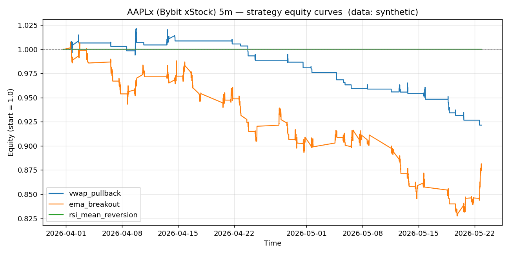

# AAPLx (Bybit xStock) 5m backtest report

- Data source: **synthetic**
- Bars analysed: **3000**

## Headline metrics

| name               |   bars |   trades | win_rate   | avg_win_pct   | avg_loss_pct   |   profit_factor | expectancy_pct   | total_return_pct   | max_drawdown_pct   |   sharpe |   avg_bars_held |
|:-------------------|-------:|---------:|:-----------|:--------------|:---------------|----------------:|:-----------------|:-------------------|:-------------------|---------:|----------------:|
| vwap_pullback      |   3000 |       42 | 14.29%     | 0.606%        | -0.326%        |            0.31 | -0.193%          | -7.85%             | -9.80%             |    -5.27 |             8   |
| ema_breakout       |   3000 |      104 | 28.85%     | 0.778%        | -0.490%        |            0.64 | -0.124%          | -12.55%            | -17.86%            |    -3.9  |            15.6 |
| rsi_mean_reversion |   3000 |        0 | 0.00%      | 0.000%        | 0.000%         |            0    | 0.000%           | 0.00%              | 0.00%              |     0    |             0   |

## vwap_pullback

- Trades: **42**  |  Win rate: **14.29%**  |  Profit factor: **0.31**  |  Max DD: **-9.80%**
- Total return: **-7.85%**  |  Expectancy/trade: **-0.193%**  |  Sharpe (annualised): **-5.27**

## ema_breakout

- Trades: **104**  |  Win rate: **28.85%**  |  Profit factor: **0.64**  |  Max DD: **-17.86%**
- Total return: **-12.55%**  |  Expectancy/trade: **-0.124%**  |  Sharpe (annualised): **-3.90**

## rsi_mean_reversion

- Trades: **0**  |  Win rate: **0.00%**  |  Profit factor: **0.00**  |  Max DD: **0.00%**
- Total return: **0.00%**  |  Expectancy/trade: **0.000%**  |  Sharpe (annualised): **0.00**
