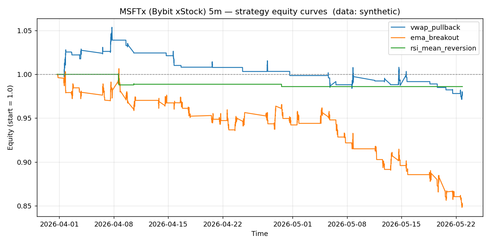

# MSFTx (Bybit xStock) 5m backtest report

- Data source: **synthetic**
- Bars analysed: **3000**

## Headline metrics

| name               |   bars |   trades | win_rate   | avg_win_pct   | avg_loss_pct   |   profit_factor | expectancy_pct   | total_return_pct   | max_drawdown_pct   |   sharpe |   avg_bars_held |
|:-------------------|-------:|---------:|:-----------|:--------------|:---------------|----------------:|:-----------------|:-------------------|:-------------------|---------:|----------------:|
| vwap_pullback      |   3000 |       36 | 25.00%     | 0.820%        | -0.348%        |            0.78 | -0.056%          | -2.08%             | -7.81%             |    -1.13 |            11.9 |
| ema_breakout       |   3000 |      104 | 31.73%     | 0.637%        | -0.519%        |            0.57 | -0.152%          | -14.81%            | -15.74%            |    -5.13 |            15.8 |
| rsi_mean_reversion |   3000 |        3 | 33.33%     | 0.074%        | -0.738%        |            0.05 | -0.467%          | -1.40%             | -1.46%             |    -4.91 |             6.7 |

## vwap_pullback

- Trades: **36**  |  Win rate: **25.00%**  |  Profit factor: **0.78**  |  Max DD: **-7.81%**
- Total return: **-2.08%**  |  Expectancy/trade: **-0.056%**  |  Sharpe (annualised): **-1.13**

## ema_breakout

- Trades: **104**  |  Win rate: **31.73%**  |  Profit factor: **0.57**  |  Max DD: **-15.74%**
- Total return: **-14.81%**  |  Expectancy/trade: **-0.152%**  |  Sharpe (annualised): **-5.13**

## rsi_mean_reversion

- Trades: **3**  |  Win rate: **33.33%**  |  Profit factor: **0.05**  |  Max DD: **-1.46%**
- Total return: **-1.40%**  |  Expectancy/trade: **-0.467%**  |  Sharpe (annualised): **-4.91**
