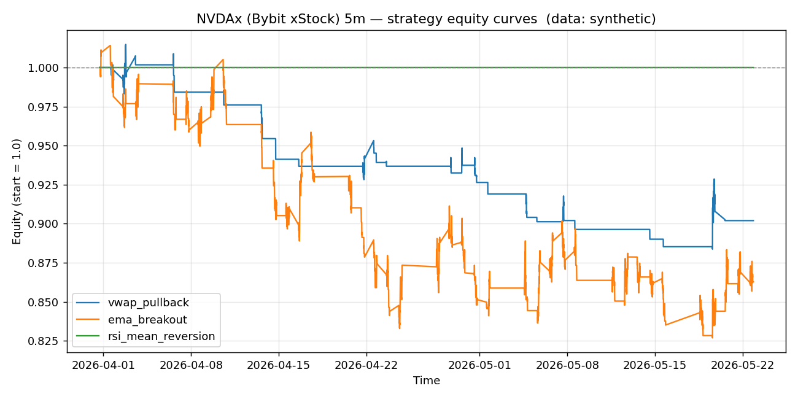

# NVDAx (Bybit xStock) 5m backtest report

- Data source: **synthetic**
- Bars analysed: **3000**

## Headline metrics

| name               |   bars |   trades | win_rate   | avg_win_pct   | avg_loss_pct   |   profit_factor | expectancy_pct   | total_return_pct   | max_drawdown_pct   |   sharpe |   avg_bars_held |
|:-------------------|-------:|---------:|:-----------|:--------------|:---------------|----------------:|:-----------------|:-------------------|:-------------------|---------:|----------------:|
| vwap_pullback      |   3000 |       33 | 15.15%     | 1.352%        | -0.601%        |            0.4  | -0.305%          | -9.80%             | -12.91%            |    -3.96 |             8   |
| ema_breakout       |   3000 |      110 | 32.73%     | 1.272%        | -0.804%        |            0.77 | -0.124%          | -13.72%            | -18.46%            |    -2.27 |            15.1 |
| rsi_mean_reversion |   3000 |        0 | 0.00%      | 0.000%        | 0.000%         |            0    | 0.000%           | 0.00%              | 0.00%              |     0    |             0   |

## vwap_pullback

- Trades: **33**  |  Win rate: **15.15%**  |  Profit factor: **0.40**  |  Max DD: **-12.91%**
- Total return: **-9.80%**  |  Expectancy/trade: **-0.305%**  |  Sharpe (annualised): **-3.96**

## ema_breakout

- Trades: **110**  |  Win rate: **32.73%**  |  Profit factor: **0.77**  |  Max DD: **-18.46%**
- Total return: **-13.72%**  |  Expectancy/trade: **-0.124%**  |  Sharpe (annualised): **-2.27**

## rsi_mean_reversion

- Trades: **0**  |  Win rate: **0.00%**  |  Profit factor: **0.00**  |  Max DD: **0.00%**
- Total return: **0.00%**  |  Expectancy/trade: **0.000%**  |  Sharpe (annualised): **0.00**
