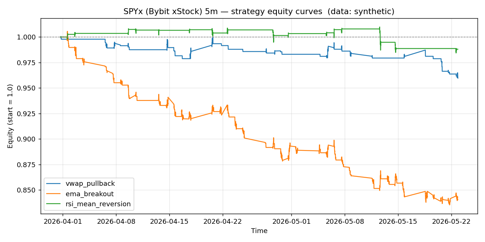

# SPYx (Bybit xStock) 5m backtest report

- Data source: **synthetic**
- Bars analysed: **3000**

## Headline metrics

| name               |   bars |   trades | win_rate   | avg_win_pct   | avg_loss_pct   |   profit_factor | expectancy_pct   | total_return_pct   | max_drawdown_pct   |   sharpe |   avg_bars_held |
|:-------------------|-------:|---------:|:-----------|:--------------|:---------------|----------------:|:-----------------|:-------------------|:-------------------|---------:|----------------:|
| vwap_pullback      |   3000 |       38 | 18.42%     | 0.505%        | -0.246%        |            0.46 | -0.108%          | -4.04%             | -4.09%             |    -4.15 |            10.2 |
| ema_breakout       |   3000 |      102 | 21.57%     | 0.439%        | -0.336%        |            0.36 | -0.169%          | -15.95%            | -16.92%            |    -8.92 |            14.7 |
| rsi_mean_reversion |   3000 |       16 | 56.25%     | 0.194%        | -0.419%        |            0.6  | -0.074%          | -1.20%             | -2.53%             |    -1.38 |            21.2 |

## vwap_pullback

- Trades: **38**  |  Win rate: **18.42%**  |  Profit factor: **0.46**  |  Max DD: **-4.09%**
- Total return: **-4.04%**  |  Expectancy/trade: **-0.108%**  |  Sharpe (annualised): **-4.15**

## ema_breakout

- Trades: **102**  |  Win rate: **21.57%**  |  Profit factor: **0.36**  |  Max DD: **-16.92%**
- Total return: **-15.95%**  |  Expectancy/trade: **-0.169%**  |  Sharpe (annualised): **-8.92**

## rsi_mean_reversion

- Trades: **16**  |  Win rate: **56.25%**  |  Profit factor: **0.60**  |  Max DD: **-2.53%**
- Total return: **-1.20%**  |  Expectancy/trade: **-0.074%**  |  Sharpe (annualised): **-1.38**
