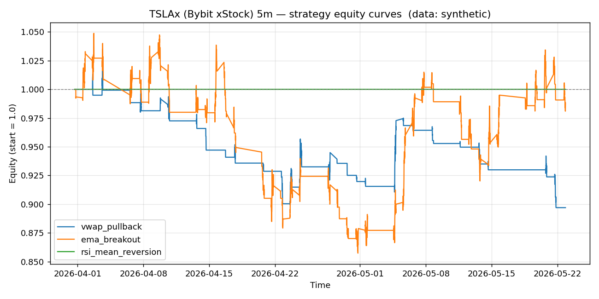

# TSLAx (Bybit xStock) 5m backtest report

- Data source: **synthetic**
- Bars analysed: **3000**

## Headline metrics

| name               |   bars |   trades | win_rate   | avg_win_pct   | avg_loss_pct   |   profit_factor | expectancy_pct   | total_return_pct   | max_drawdown_pct   |   sharpe |   avg_bars_held |
|:-------------------|-------:|---------:|:-----------|:--------------|:---------------|----------------:|:-----------------|:-------------------|:-------------------|---------:|----------------:|
| vwap_pullback      |   3000 |       47 | 12.77%     | 2.210%        | -0.575%        |            0.56 | -0.219%          | -10.30%            | -12.34%            |    -3.19 |             9.9 |
| ema_breakout       |   3000 |       97 | 36.08%     | 1.650%        | -0.930%        |            1    | 0.001%           | -1.19%             | -18.24%            |     0.01 |            16.5 |
| rsi_mean_reversion |   3000 |        0 | 0.00%      | 0.000%        | 0.000%         |            0    | 0.000%           | 0.00%              | 0.00%              |     0    |             0   |

## vwap_pullback

- Trades: **47**  |  Win rate: **12.77%**  |  Profit factor: **0.56**  |  Max DD: **-12.34%**
- Total return: **-10.30%**  |  Expectancy/trade: **-0.219%**  |  Sharpe (annualised): **-3.19**

## ema_breakout

- Trades: **97**  |  Win rate: **36.08%**  |  Profit factor: **1.00**  |  Max DD: **-18.24%**
- Total return: **-1.19%**  |  Expectancy/trade: **0.001%**  |  Sharpe (annualised): **0.01**

## rsi_mean_reversion

- Trades: **0**  |  Win rate: **0.00%**  |  Profit factor: **0.00**  |  Max DD: **0.00%**
- Total return: **0.00%**  |  Expectancy/trade: **0.000%**  |  Sharpe (annualised): **0.00**
